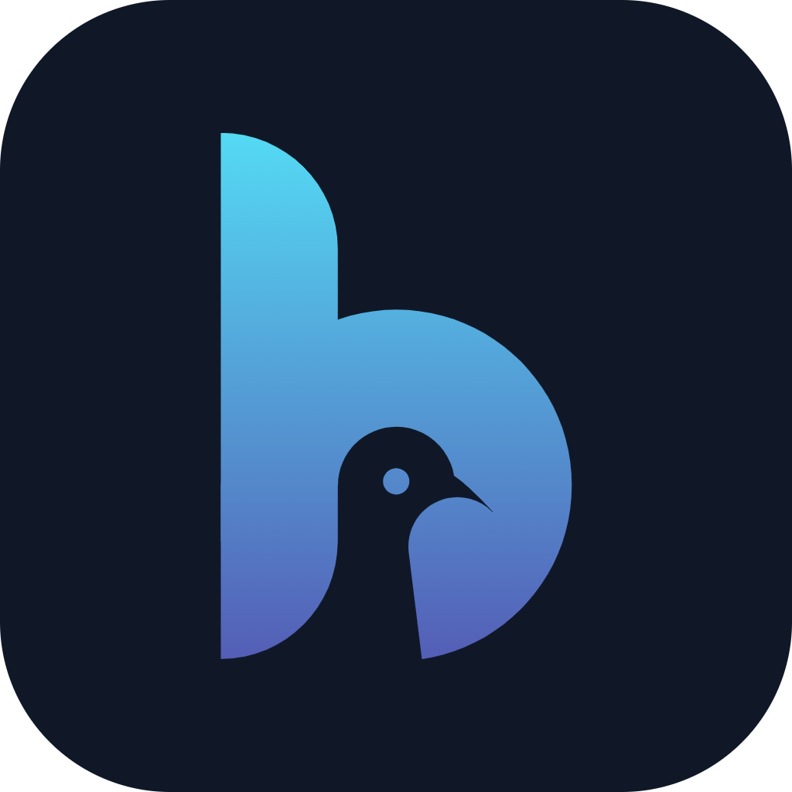
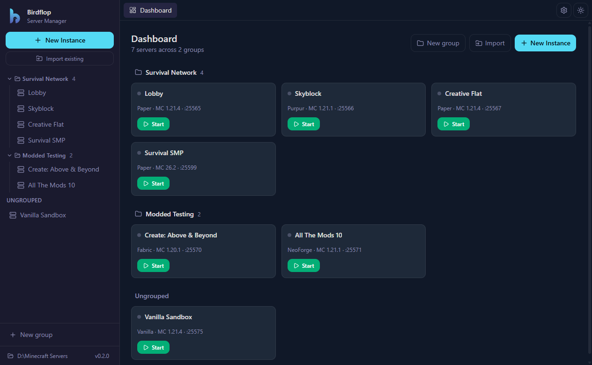
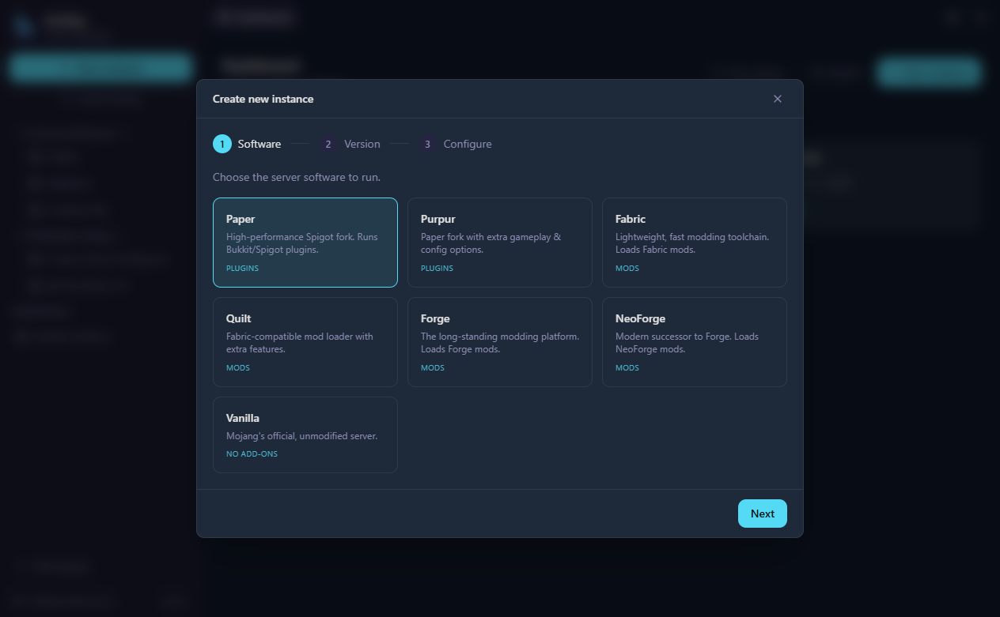
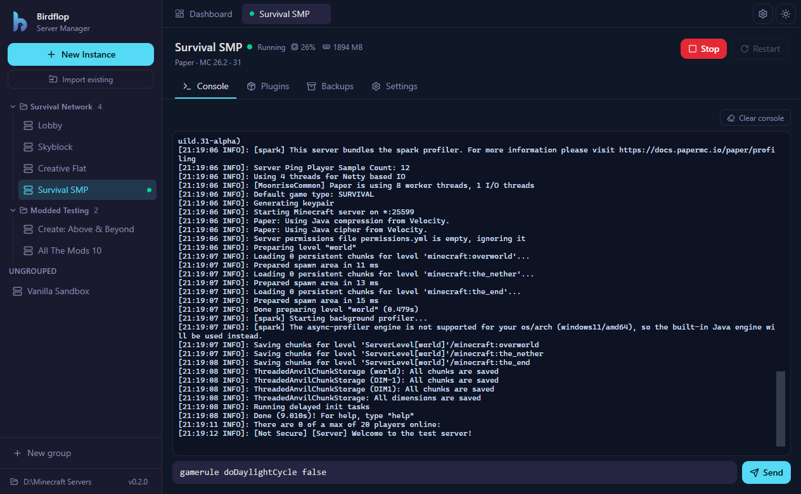
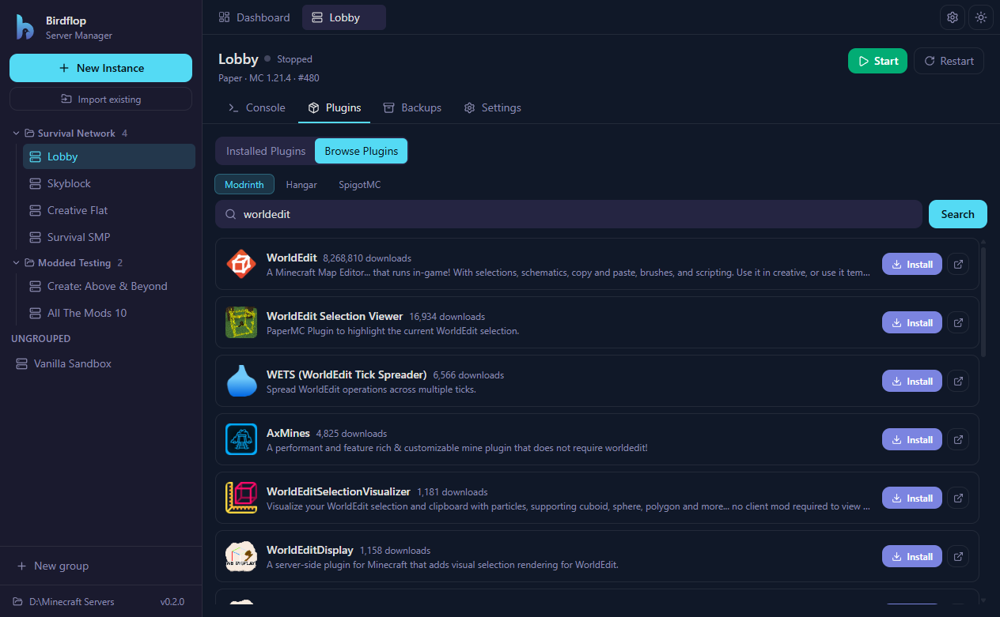
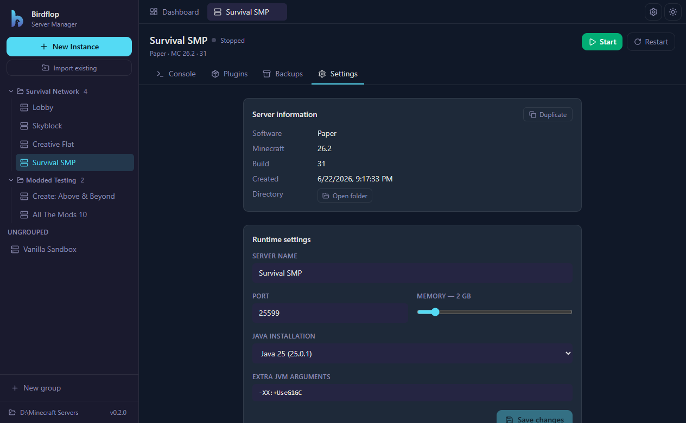
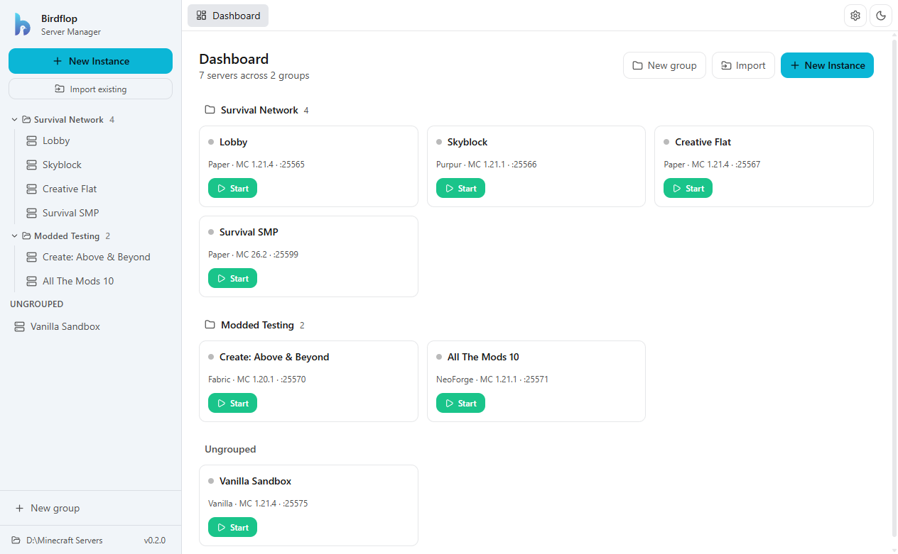

<div align="center">



# Birdflop Server Manager

**Create, run, and manage local Minecraft test servers — from one clean desktop app.**

Spin up Paper, Purpur, Fabric, Quilt, Forge, NeoForge, or Vanilla servers in a few clicks. The app fetches the right build, downloads a matching Java runtime, installs plugins/mods from Modrinth, Hangar & SpigotMC, and gives every server a live console — on Windows, macOS, and Linux.

[](https://github.com/birdflop/server-manager/releases/latest)
[](https://github.com/birdflop/server-manager/actions/workflows/ci.yml)
[](LICENSE.md)


<br />



</div>

---

## Why

Testing a plugin or mod usually means hand-downloading the right server jar, fiddling with `eula.txt`, hunting for the correct Java version, and juggling terminal windows. Birdflop Server Manager turns that into a point-and-click workflow, and keeps every test server organized in one place so you can run several at once.

- **No terminal gymnastics** — pick software + version, the app downloads and configures everything.
- **Bring nothing** — it auto-detects your installed JDKs and downloads a matching Temurin runtime when one is missing.
- **Run many at once** — each server has its own tab, console buffer, and live CPU/RAM readout.
- **Stays out of your files** — servers are plain folders on disk; you can open, back up, or import them at any time.

## Features

### Guided server creation

A three-step wizard: choose the software, pick a Minecraft version and build (fetched live from each project's API), then configure name, port, memory, Java, and JVM args. Forge/NeoForge installers and Quilt/Fabric loaders are handled for you.



### Live console per server

Full color console powered by xterm.js — streams stdout/stderr in real time, keeps scrollback when you switch tabs, and lets you send commands (with history) straight to the server. Start, stop, and restart from the header, with a live status dot and CPU/memory usage.



### Plugins & mods, built in

Browse and one-click install content without leaving the app. Plugin servers search **Modrinth**, **Hangar**, and **SpigotMC**; mod loaders search **Modrinth** — filtered automatically to your server's loader. You can also drag & drop `.jar` files in.



### Settings, backups & organization

Edit runtime settings (port, memory slider, Java install, extra JVM args), snapshot the whole server folder to a backup and restore it later, duplicate a server, or organize servers into collapsible groups with drag & drop. Import an existing server folder to bring it under management.

See [**Server settings**](docs/server-settings.md) for a full reference of every per-server option, including the file watcher, remote debugging (JDWP), and the `server.properties` editor.



### File watcher (auto-restart on change)

Point a server at one or more files or folders (e.g. its `plugins`/`mods` folder, or `server.properties`) and have it automatically restart — or run a console command like `reload confirm` — whenever those files change. Ideal for the plugin/mod development loop: rebuild your jar, drop it in, and the server reloads itself. Changes are debounced and wait for writes to finish, so a half-written jar won't trigger a restart. Configured per server in **Settings**; only acts while the server is running.

### Share a server (tunneling)

Expose a local test server to friends without port-forwarding. The **Share** tab opens a tunnel through a relay and gives you a public address to hand out, with a per-server Start/Stop control and live status. **bore** (via the free [bore.pub](https://bore.pub) relay) is the default — no account, no card, works on every platform. **ngrok** is also available if you have a token (note: ngrok now requires a card on file for TCP endpoints).

### Light & dark themes

Styled to the Birdflop brand, with a one-click theme toggle.



## Supported server software

| Software | Add-ons | Installed from | Content sources |
| --- | --- | --- | --- |
| **Paper** | Plugins | Runnable jar | Modrinth · Hangar · SpigotMC |
| **Purpur** | Plugins | Runnable jar | Modrinth · Hangar · SpigotMC |
| **Fabric** | Mods | Runnable jar | Modrinth |
| **Quilt** | Mods | Installer | Modrinth |
| **Forge** | Mods | Installer | Modrinth |
| **NeoForge** | Mods | Installer | Modrinth |
| **Vanilla** | — | Runnable jar | — |

> Spigot/Bukkit aren't included (no public download API — they require local BuildTools compilation).

## Download & install

Grab the latest installer for your platform from the [**Releases page**](https://github.com/birdflop/server-manager/releases/latest).

### Windows
Download and run the `.exe` (NSIS installer). The app auto-updates on future releases.

### macOS
Download the `.dmg` (or `.zip`) for your chip. Release builds aren't signed with an Apple Developer ID, so the first launch needs **right-click → Open** (or **System Settings → Privacy & Security → "Open Anyway"**). The build is ad-hoc signed so Apple Silicon won't report it as "damaged."

If a downloaded build still won't open, clear the quarantine flag:

```bash
xattr -dr com.apple.quarantine "/Applications/Birdflop Server Manager.app"
```

### Linux
Download the `.AppImage` (mark it executable and run) or install the `.deb`:

```bash
chmod +x "Birdflop Server Manager-*.AppImage" && ./"Birdflop Server Manager-"*.AppImage
# or
sudo dpkg -i birdflop-server-manager_*.deb
```

## Getting started

1. **Pick a servers folder** on first launch. Every server lives in its own subfolder here, tracked by an index file — you can move or back up this folder anytime.
2. **Create an instance** — click **New Instance**, choose software → version/build → configure, and let the app download and install it. Tick "accept EULA" to skip the manual `eula.txt` step.
3. **Start it** from the dashboard card or the server's header, then watch the **Console** come to life.
4. **Add plugins/mods** from the Plugins/Mods tab, tweak **Settings**, and snapshot **Backups** as you test.

Servers run as real processes; closing a server's tab keeps it running. Multiple servers can run side by side.

## How servers are stored

```
<your servers folder>/
├─ birdflop-manager.json        # groups + instance index
└─ instances/
   └─ <id>/
      ├─ instance.json          # this server's config (managed by the app)
      ├─ server.jar             # (or installer args-files for Forge/NeoForge)
      ├─ server.properties
      ├─ plugins/  or  mods/
      └─ world/, logs/, ...
```

Because everything is just files, you can inspect, copy, or hand-edit a server — and **Import existing** pulls an outside server folder into the manager.

## Java handling

You don't need to install Java yourself. The app detects JDK/JREs already on your machine and, when none match, downloads a managed **Eclipse Temurin** runtime for the version the server needs:

| Minecraft version | Java |
| --- | --- |
| 1.20.5+ and calendar versions (e.g. `26.2`) / snapshots | **21** |
| 1.17 – 1.20.4 | **17** |
| ≤ 1.16 | **8** |

You can override the runtime per server in its Settings.

## Development

```bash
npm install          # also runs electron's postinstall to fetch its binary
npm run dev          # launch with HMR
npm run typecheck    # tsc for main/preload + renderer
npm run build        # bundle main/preload/renderer into out/
```

If `node_modules` is wiped and the Electron binary doesn't download, run `node node_modules/electron/install.js` (or `npm rebuild electron`).

**Tech stack:** Electron · React 19 · TypeScript · Vite (via [electron-vite](https://electron-vite.org)) · Tailwind CSS v4 · Zustand · xterm.js.

```
src/
├─ main/       # Electron main process — software providers, Java, install, launch, IPC
├─ preload/    # contextBridge API exposed to the renderer
├─ renderer/   # React UI (views, modals, components, store)
└─ shared/     # types + software metadata shared across processes
```

## Packaging

```bash
npm run dist         # current-platform installer
npm run dist:win     # NSIS installer (Windows)
npm run dist:mac     # dmg + zip (macOS)
npm run dist:linux   # AppImage + deb (Linux)
npx electron-builder --dir   # unpacked app only (fast config check)
```

Releases are automated: merging to `main` runs [release-please](https://github.com/googleapis/release-please), and tagged releases build + upload installers for all three platforms via GitHub Actions.

### macOS signing & notarization

`build/afterPack.js` ad-hoc signs the `.app` during macOS builds so unsigned downloads still open via right-click → Open. For a warning-free experience, set `CSC_LINK` / `CSC_KEY_PASSWORD` (a Developer ID cert) plus Apple notarization secrets — electron-builder then signs + notarizes automatically and the ad-hoc step is skipped.

## Dev / test environment flags

These are gated behind env vars and never run in normal use (handy for development and the screenshots above):

- `BSM_ROOT=<dir>` — override the data root without touching real config.
- `BSM_THEME=light|dark` — force a theme.
- `BSM_SCREENSHOT=<png>` `BSM_DRIVE=<js>` — render the UI (optionally running a JS snippet against `window.__bsmStore` / `window.api`) and capture a screenshot, then exit.
- `BSM_ICON=<png>` — regenerate the brand app icon.
- `BSM_SELFTEST=1` — run provider/Java integration checks. Combine with `BSM_TESTJAVA=<major>`, `BSM_TESTCREATE=1`, `BSM_TESTRUN=1`, `BSM_TESTMODRINTH=1`.

## Contributing

Issues and pull requests are welcome. Please run `npm run typecheck` before opening a PR; commit messages follow [Conventional Commits](https://www.conventionalcommits.org) (they drive automated releases).

## License

[GNU AGPL v3](LICENSE.md) © Birdflop
